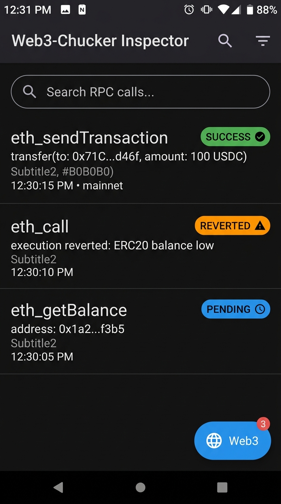

# 🌐 web3-chucker

[](LICENSE)
[](https://kotlinlang.org)
[](https://developer.android.com)

> **OkHttp JSON-RPC Interceptor & Jetpack Compose Debug UI Overlay for Android Web3 Applications.**

<p align="center">
  
</p>

---

## ✨ Features

- 🔍 **Automatic EVM 4-Byte Selector Decoding**: Decodes hex input data (`0xa9059cbb`, `0x095ea7b3`) into human-readable signatures like `transfer(to: 0x71C..., amount: 100 USDC)`.
- ⚡ **Zero-Dependency OkHttp Interceptor**: Simply add `Web3ChuckerInterceptor()` to your `OkHttpClient`.
- 📱 **Jetpack Compose Overlay Drawer**: Floating badge showing live request counts and an expandable modal drawer for full RPC parameter/response inspection.
- 🚨 **Revert & Error Highlighting**: Automatically detects EVM transaction reverts, error codes (`-32000`), and network timeouts with visual status indicators.
- 📋 **1-Tap Log Copy**: Easily copy raw JSON payloads, formatted headers, and decoded params for bug reporting.

---

## 📦 Quickstart

### 1. Add Dependency

Add the dependency to your `:app` or `:feature` `build.gradle.kts`:

```kotlin
dependencies {
    implementation("io.github.zakayothuku:web3-chucker:1.0.0")
}
```

### 2. Attach OkHttp Interceptor

```kotlin
val okHttpClient = OkHttpClient.Builder()
    .addInterceptor(Web3ChuckerInterceptor(enabled = BuildConfig.DEBUG))
    .build()
```

### 3. Attach Compose Overlay UI

Add `Web3ChuckerOverlay()` inside your top-level Jetpack Compose `Surface` or `Scaffold`:

```kotlin
@Composable
fun MainScreen() {
    Box(modifier = Modifier.fillMaxSize()) {
        YourAppContent()

        // Attach web3-chucker debug floating badge & drawer
        Web3ChuckerOverlay()
    }
}
```

---

## 🛠️ Architecture Overview

```
web3-chucker/
├── library/
│   ├── src/main/java/io/github/web3chucker/
│   │   ├── Web3ChuckerInterceptor.kt    # OkHttp Interceptor catching JSON-RPC POST requests
│   │   ├── RpcTransactionDecoder.kt     # EVM 4-byte selector & hex parameter parser
│   │   ├── Web3ChuckerRepository.kt     # Circular buffer StateFlow store
│   │   ├── model/
│   │   │   └── Web3RpcTransaction.kt    # Transaction & status data models
│   │   └── ui/
│   │       └── Web3ChuckerOverlay.kt    # Jetpack Compose UI Badge & Modal Inspector
└── sample/                              # Demo app showcasing live RPC interception
```

---

## 🧪 Testing

Run unit tests for the EVM function selector and hex decoder:

```bash
./gradlew :library:test
```

Build the sample app:

```bash
./gradlew :sample:assembleDebug
```

---

## 📄 License & Author

Developed & maintained by **Zakayo Thuku** ([@zakayothuku](https://github.com/zakayothuku)).

```
MIT License - Copyright (c) 2026 Zakayo Thuku
```
